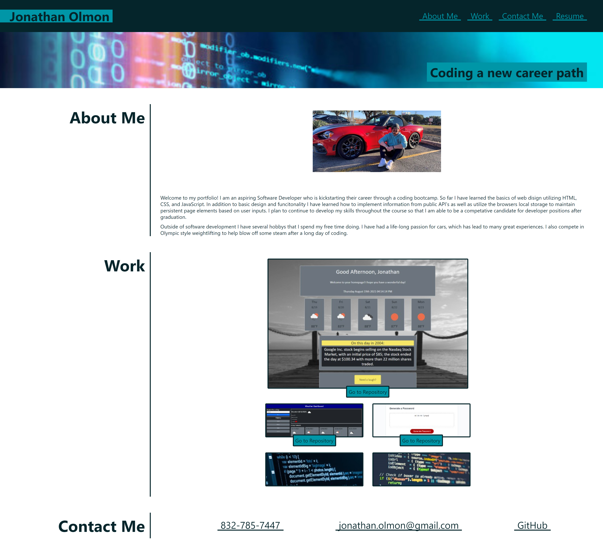

# Advanced CSS: Portfolio

## Purpose

The Purpose of this project was to create a portfolio using HTML and CSS for myself. Influence was taken from the example page we were given with the assignment.

A list of the feature site contains is:
- Functioning navigation bar to move around the page
- Images for each project that currently display coming soon and link back to current page until they are ready to be added. 
- Funcitoning contact me menu.
- A dynamic layout that changes when the screen resolution is reduced below 992px.

The site can be found at: https://jpolmon.github.io/PortfolioHW02/

---
## Appearance

When visited the site should roughly appear as:  

